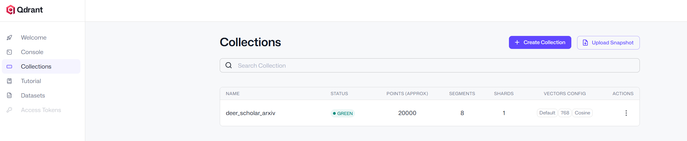
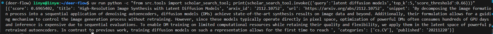

# Deer-Scholar：基于 DeerFlow + Qdrant + Ollama 的本地论文 RAG 科研助手（离线可部署）

> 本项目是在字节跳动开源项目 **deer-flow** 的基础上进行二次开发，新增 **本地论文向量库（Qdrant）** 与 **本地检索工具（scholar_search）**，实现“本地语料检索增强生成（RAG）”的科研问答能力。
>
> 目标：
>
> * 支持 **离线/内网部署**（Ollama 本地 Embedding + 本地/Windows Docker Qdrant）
> * 支持 **基于 arXiv 论文语料的证据式问答**（返回 arXiv id/URL/snippet）
> * 支持 DeerFlow Agent 工作流调用工具，形成可展示的工程闭环

---

## 1. 项目结构

在 deer-flow 原项目基础上新增/修改：

* `src/tools/scholar.py`：新增本地论文检索工具 `scholar_search_tool`
* `src/tools/__init__.py`：导出 `scholar_search_tool`
* `src/graph/nodes.py`：在 `researcher_node` 的 tools 列表中加入 `scholar_search_tool`
* `scripts/ingest_ai_arxiv_chunked.py`：本地知识库构建（数据加载→向量化→Qdrant upsert）

> 注：`scripts/ingest_ai_arxiv_chunked.py` 脚本用于将 HuggingFace 上的 `jamescalam/ai-arxiv-chunked` 数据集入库到 Qdrant，作为本地论文知识库。该数据集收集了来自 ArXiv 的 400 多篇与机器学习、自然语言处理、大型语言模型等主题相关的论文，文本已经被预处理成较小的段落（通常是 1–2 段落），每条记录对应一种“chunk”，从而支持快速检索或嵌入计算。

---

## 2. 环境与依赖

### 2.1 系统与工具

* Windows：安装 Docker Desktop（用于运行 Qdrant）
* WSL Ubuntu / Linux / macOS：运行 deer-flow 与 Python 环境（uv 管理）
* Ollama：本地模型服务（Embedding）此处使用 `nomic-embed-text:latest`

### 2.2 Python 依赖（uv）

在 deer-flow 根目录（推荐直接安装项目锁定依赖）：

```bash
uv sync
```

> 如果你是二次开发需要新增依赖，再用 `uv add ...` 添加并提交 `pyproject.toml`/`uv.lock`。

---

## 3. 从零开始：Clone 并启动 deer-flow

### 3.1 Clone 项目

```bash
git clone https://github.com/bytedance/deer-flow
cd deer-flow
```

### 3.2 配置 deer-flow（按项目[原 README](deer-flow/README_office.md)）

* 按 deer-flow 官方流程配置 `.env` 与 `conf.yaml`
* 确保 `uv run main.py` 能正常启动

> 说明：你可以先使用 SiliconFlow 等云端 LLM 作为 Chat 模型；后续要完全离线部署时再把 Chat LLM 也切到 Ollama。

---

## 4. 构建本地知识库：Qdrant + arXiv 数据

### 4.1 下载启动 Qdrant（Windows Docker Desktop）

在 Windows PowerShell：

```powershell
docker pull qdrant/qdrant
docker volume create qdrant-storage

docker run -d --name qdrant `
  -p 6333:6333 -p 6334:6334 `
  -v qdrant-storage:/qdrant/storage `
  qdrant/qdrant
```

Linux/macOS（同样适用）：

```bash
docker pull qdrant/qdrant
docker volume create qdrant-storage
docker run -d --name qdrant \
  -p 6333:6333 -p 6334:6334 \
  -v qdrant-storage:/qdrant/storage \
  qdrant/qdrant
```

验证：

* Dashboard：`http://localhost:6333/dashboard`
* 或 WSL 中：

```bash
curl -sSf http://localhost:6333 >/dev/null && echo OK
```


### 4.2 启动 Ollama 并准备 Embedding 模型

```bash
ollama serve
ollama pull nomic-embed-text:latest
```

> 本项目要求：**入库与查询必须使用同一个 embedding 模型**。本文默认 `nomic-embed-text:latest`。

### 4.3 环境变量（建议写入 deer-flow 的 `.env`）

```bash
# Qdrant
QDRANT_URL=http://localhost:6333
QDRANT_COLLECTION=deer_scholar_arxiv

# Ollama Embedding
OLLAMA_BASE_URL=http://localhost:11434
OLLAMA_EMBED_MODEL=nomic-embed-text:latest

# 检索阈值：根据标定结果设置（本项目经验值 0.62）
SCHOLAR_SCORE_THRESHOLD=0.62
```

> 注：你已验证本项目数据分布下 `0.62` 比 `0.72/0.75` 更合理。

---

## 5. 知识库入库（ETL Pipeline）：数据加载 → 向量化 → Qdrant 写入

### 5.1 数据源选择

推荐使用 HuggingFace 数据集：

* `jamescalam/ai-arxiv-chunked`（已 chunk 化、字段丰富，适合做可引用证据检索）

### 5.2 入库脚本：`scripts/ingest_ai_arxiv_chunked.py`

核心流程：

1. `datasets.load_dataset()` 下载并缓存本地数据
2. 将每条记录（title/summary/chunk）拼接为可检索文本
3. 调用 Ollama `/api/embed` 生成向量
4. 将向量与 payload（title/arxiv_id/categories/...）写入 Qdrant collection

运行建议：

* 先小规模验证，再扩大

```bash
uv run python scripts/ingest_ai_arxiv_chunked.py --recreate --limit 2000
uv run python scripts/ingest_ai_arxiv_chunked.py --limit 20000
```

> 注意：`--recreate` 会删除并重建 collection（等价于清空重来）。

验收：

* Qdrant Dashboard （`http://localhost:6333/dashboard#/collections`）能看到 collection：`deer_scholar_arxiv`
  

---

## 6. 本地检索工具开发：`scholar_search_tool`（核心能力）

### 6.1 工具目标

为 DeerFlow Agent 提供一个可调用工具：

* 输入：用户 query（可选 category/year_from）
* 输出：TopK 论文证据列表（去重、带 snippet、可引用）

### 6.2 技术路线

1. Query Embedding：

* 调用 Ollama Embedding API：`POST /api/embed`
* 使用与入库一致的 `nomic-embed-text:latest`

2. Qdrant 相似度检索：

* Cosine 相似度（默认）
* `score_threshold` 用于过滤低相关结果（本项目经验值 0.62）

3. Paper-level 去重：

* Qdrant 返回的是 chunk（point）级别结果
* 按 payload 的 `arxiv_id` 聚合，保留每篇论文最高分 chunk

4. 证据返回：

* `title/arxiv_id/url/snippet/categories/published/score`
* snippet 从 payload 的 `chunk/text/summary/abstract` 中提取

### 6.3 代码位置

`src/tools/scholar.py`：定义 `@tool("scholar_search")` 的 `scholar_search_tool`

### 6.4 测试

在 deer-flow 根目录执行：

```bash
uv run python -c "from src.tools import scholar_search_tool; print(scholar_search_tool.invoke({'query':'latent diffusion models','top_k':5,'score_threshold':0.60}))"
```

查看返回结果，预期包含 1～5 条 `latent diffusion models`相关论文（去重后按论文计数），包含 `snippet` 与 `arxiv_id/url`。


---

## 7. 将工具接入 DeerFlow（让 Agent 真正调用）

### 7.1 导出工具：`src/tools/__init__.py`

在文件中新增：

```python
from .scholar import scholar_search_tool
```

并加入 `__all__`：

```python
"scholar_search_tool",
```

### 7.2 挂载到 researcher_node：`src/graph/nodes.py`

在 `researcher_node` 中将工具加入列表（建议放在前面，优先本地检索）：

```python
tools = [
    scholar_search_tool,
    get_web_search_tool(configurable.max_search_results),
    crawl_tool,
]
```

> 你当前已完成此步，并能看到 researcher_node 的 tools 列表包含 `scholar_search_tool`。

---

## 8. 运行方式

### 8.1 Console（最推荐的正式运行方式）

```bash
uv run main.py
```

然后输入问题。

> 说明：默认模式会走 DeerFlow 的 planner/researcher 工作流；如果你希望直接做“本地论文证据问答”，建议使用 Deer‑Scholar 模式（见下文 Web UI / API）。

### 8.2 Web UI

（按 deer-flow 官方 README）

```bash
cd web
pnpm install
cd ..
./bootstrap.sh -d
```

浏览器打开：`http://localhost:3000`

在页面顶部的下拉框选择：

* `DeerFlow`：默认研究工作流（可能会触发 web search / crawl）
* `Deer‑Scholar`：直接走本地论文 QA（prompt: `src/prompts/scholar.md`，工具: `scholar_search`）

---

## 9. 常见问题排查（非常实用）

### 9.1 Qdrant collection 有了但检索为空

* 检查 `SCHOLAR_SCORE_THRESHOLD` 是否过高（你已验证 0.62 合理）
* 检查入库与查询是否同一 embedding 模型：`nomic-embed-text:latest`

### 9.2 同一篇论文重复出现

* 这是 chunk-level 检索的正常现象
* 本项目已在 tool 中按 `arxiv_id` 聚合去重

### 9.3 DeerFlow 运行时不调用工具

* 这是 Coordinator 判定“无需工具”的常见行为
* 解决：

  1. 提问时显式要求使用 `scholar_search`
  2. 调整 prompt/配置：让 researcher 对学术问题默认启用

---

## 10. API 调用（可选）

DeerFlow 后端 SSE 接口：`POST /api/chat/stream`。

Deer‑Scholar 模式示例（通过 `mode` 路由，不需要 `/scholar` 前缀）：

```bash
curl -X POST http://localhost:8000/api/chat/stream \
  -H "Content-Type: application/json" \
  -d '{
    "mode": "scholar",
    "thread_id": "conversation_scholar_1",
    "messages": [{"role": "user", "content": "请基于本地检索到的论文片段回答：LoRA 的核心思想是什么？并给出 [arXiv:ID] 引用。"}]
  }'
```

---

## 11. 项目亮点

* 基于 DeerFlow Agent 工作流扩展本地检索工具，实现“本地证据优先”的 RAG 问答闭环
* 构建 Qdrant 本地向量知识库：数据加载→向量化→upsert→检索去重
* 实现 RAG 降幻觉策略：返回可引用证据（arXiv id/URL/snippet），并用相似度阈值控制低相关结果
* 兼容离线部署：Ollama Embedding + 本地/内网 Qdrant

---

## 12. License

本项目遵循 [deer-flow ](https://github.com/bytedance/deer-flow)原项目 License（MIT）。
