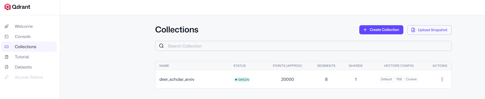
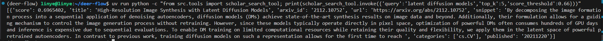
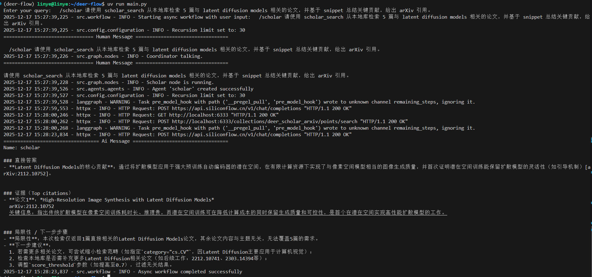

# Deer-Scholar：基于 DeerFlow + Qdrant + Ollama 的本地论文 RAG 科研助手（离线可部署）

> 本项目是在字节跳动开源项目 **deer-flow** 的基础上进行二次开发，新增 **本地论文向量库（Qdrant）** 与 **本地检索工具（scholar_search）**，实现“本地语料检索增强生成（RAG）”的科研问答能力。
>
> 目标：
>
> * 支持 **离线/内网部署**（Ollama 本地 Embedding + 本地/Windows Docker Qdrant）
> * 支持 **基于 arXiv 论文语料的证据式问答**（返回 arXiv id/URL/snippet）
> * 支持 DeerFlow Agent 工作流调用工具，形成可展示的工程闭环

---

## 1. 项目结构

在 deer-flow 原项目基础上新增/修改：

* `src/tools/scholar.py`：新增本地论文检索工具 `scholar_search_tool`
* `src/tools/__init__.py`：导出 `scholar_search_tool`
* `src/graph/nodes.py`：在 `researcher_node` 的 tools 列表中加入 `scholar_search_tool`
* `scripts/ingest_ai_arxiv_chunked.py`：本地知识库构建（数据加载→向量化→Qdrant upsert）
* `src/api/`：RESTful API 层（FastAPI router + Pydantic + 中间件）
* `src/db/`：数据库持久化层（SQLite + SQLAlchemy ORM）

> 注：`scripts/ingest_ai_arxiv_chunked.py` 脚本用于将 HuggingFace 上的 `jamescalam/ai-arxiv-chunked` 数据集入库到 Qdrant，作为本地论文知识库。该数据集收集了来自 ArXiv 的 400 多篇与机器学习、自然语言处理、大型语言模型等主题相关的论文，文本已经被预处理成较小的段落（通常是 1–2 段落），每条记录对应一种”chunk”，从而支持快速检索或嵌入计算。

---

## 2. 环境与依赖

### 2.1 系统与工具

* Windows：安装 Docker Desktop（用于运行 Qdrant）
* WSL Ubuntu / Linux / macOS：运行 deer-flow 与 Python 环境（uv 管理）
* Ollama：本地模型服务（Embedding）此处使用 `nomic-embed-text:latest`

### 2.2 Python 依赖（uv）

在 deer-flow 根目录（推荐直接安装项目锁定依赖）：

```bash
uv sync
```

> 如果你是二次开发需要新增依赖，再用 `uv add ...` 添加并提交 `pyproject.toml`/`uv.lock`。

---

## 3. 从零开始：Clone 并启动 deer-flow

### 3.1 Clone 项目

```bash
git clone https://github.com/bytedance/deer-flow
cd deer-flow
```

### 3.2 配置 deer-flow（按项目[原 README](deer-flow/README_office.md)）

* 按 deer-flow 官方流程配置 `.env` 与 `conf.yaml`
* 确保 `uv run main.py` 能正常启动

> 说明：你可以先使用 SiliconFlow 等云端 LLM 作为 Chat 模型；后续要完全离线部署时再把 Chat LLM 也切到 Ollama。

---

## 4. 构建本地知识库：Qdrant + arXiv 数据

### 4.1 下载启动 Qdrant（Windows Docker Desktop）

在 Windows PowerShell：

```powershell
docker pull qdrant/qdrant
docker volume create qdrant-storage

docker run -d --name qdrant `
  -p 6333:6333 -p 6334:6334 `
  -v qdrant-storage:/qdrant/storage `
  qdrant/qdrant
```

Linux/macOS（同样适用）：

```bash
docker pull qdrant/qdrant
docker volume create qdrant-storage
docker run -d --name qdrant \
  -p 6333:6333 -p 6334:6334 \
  -v qdrant-storage:/qdrant/storage \
  qdrant/qdrant
```

验证：

* Dashboard：`http://localhost:6333/dashboard`
* 或 WSL 中：

```bash
curl -sSf http://localhost:6333 >/dev/null && echo OK
```


### 4.2 启动 Ollama 并准备 Embedding 模型

```bash
ollama serve
ollama pull nomic-embed-text:latest
```

> 本项目要求：**入库与查询必须使用同一个 embedding 模型**。本文默认 `nomic-embed-text:latest`。

### 4.3 环境变量（建议写入 deer-flow 的 `.env`）

```bash
# Qdrant
QDRANT_URL=http://localhost:6333
QDRANT_COLLECTION=deer_scholar_arxiv

# Ollama Embedding
OLLAMA_BASE_URL=http://localhost:11434
OLLAMA_EMBED_MODEL=nomic-embed-text:latest

# 检索阈值：根据标定结果设置（本项目经验值 0.62）
SCHOLAR_SCORE_THRESHOLD=0.62

# Ollama Chat 模型（用于评测脚本的生成评估，可选）
# 运行 ollama list 查看已安装的模型
OLLAMA_CHAT_MODEL=qwen3:14b
```

> 注：你已验证本项目数据分布下 `0.62` 比 `0.72/0.75` 更合理。
> 
> 注：`OLLAMA_CHAT_MODEL` 需要设置为你已安装的 Ollama 模型（如 `qwen3:14b`、`llama3.1:latest` 等），用于评测脚本的生成质量评估。

---

## 5. 知识库入库（ETL Pipeline）：数据加载 → 向量化 → Qdrant 写入

### 5.1 数据源选择

推荐使用 HuggingFace 数据集：

* `jamescalam/ai-arxiv-chunked`（已 chunk 化、字段丰富，适合做可引用证据检索）

### 5.2 入库脚本：`scripts/ingest_ai_arxiv_chunked.py`

核心流程：

1. `datasets.load_dataset()` 下载并缓存本地数据
2. 将每条记录（title/summary/chunk）拼接为可检索文本
3. 调用 Ollama `/api/embed` 生成向量
4. 将向量与 payload（title/arxiv_id/categories/...）写入 Qdrant collection

运行建议：

* 先小规模验证，再扩大

```bash
uv run python scripts/ingest_ai_arxiv_chunked.py --recreate --limit 2000
uv run python scripts/ingest_ai_arxiv_chunked.py --limit 20000
```

> 注意：`--recreate` 会删除并重建 collection（等价于清空重来）。

验收：

* Qdrant Dashboard （`http://localhost:6333/dashboard#/collections`）能看到 collection：`deer_scholar_arxiv`
  

---

## 6. 本地检索工具开发：`scholar_search_tool`（核心能力）

### 6.1 工具目标

为 DeerFlow Agent 提供一个可调用工具：

* 输入：用户 query（可选 category/year_from）
* 输出：TopK 论文证据列表（去重、带 snippet、可引用）

### 6.2 技术路线

1. Query Embedding：

* 调用 Ollama Embedding API：`POST /api/embed`
* 使用与入库一致的 `nomic-embed-text:latest`

2. Qdrant 相似度检索：

* Cosine 相似度（默认）
* `score_threshold` 用于过滤低相关结果（本项目经验值 0.62）

3. Paper-level 去重：

* Qdrant 返回的是 chunk（point）级别结果
* 按 payload 的 `arxiv_id` 聚合，保留每篇论文最高分 chunk

4. 证据返回：

* `title/arxiv_id/url/snippet/categories/published/score`
* snippet 从 payload 的 `chunk/text/summary/abstract` 中提取

### 6.3 代码位置

`src/tools/scholar.py`：定义 `@tool("scholar_search")` 的 `scholar_search_tool`

### 6.4 测试

在 deer-flow 根目录执行：

```bash
uv run python -c "from src.tools import scholar_search_tool; print(scholar_search_tool.invoke({'query':'latent diffusion models','top_k':5,'score_threshold':0.60}))"
```

查看返回结果，预期包含 1～5 条 `latent diffusion models`相关论文（去重后按论文计数），包含 `snippet` 与 `arxiv_id/url`。


---

## 7. 将工具接入 DeerFlow（让 Agent 真正调用）

### 7.1 导出工具：`src/tools/__init__.py`

在文件中新增：

```python
from .scholar import scholar_search_tool
```

并加入 `__all__`：

```python
"scholar_search_tool",
```

### 7.2 挂载到 researcher_node：`src/graph/nodes.py`

在 `researcher_node` 中将工具加入列表（建议放在前面，优先本地检索）：

```python
tools = [
    scholar_search_tool,
    get_web_search_tool(configurable.max_search_results),
    crawl_tool,
]
```

> 你当前已完成此步，并能看到 researcher_node 的 tools 列表包含 `scholar_search_tool`。

---

## 8. 运行方式

### 8.1 Console（最推荐的正式运行方式）

```bash
uv run main.py
```

然后输入问题。

> 说明：默认模式会走 DeerFlow 的 planner/researcher 工作流；如果你希望直接做“本地论文证据问答”，建议使用 Deer‑Scholar 模式，即在问题前输入'/scholar'。

demo问题

```
 /scholar 请使用 scholar_search 从本地库检索 5 篇与 latent diffusion models 相关的论文，并基于 snippet 总结关键贡献，给出 arXiv 引用。
```



### 8.2 Web UI

（按 deer-flow 官方 README）

```bash
cd web
pnpm install
cd ..
./bootstrap.sh -d
```

浏览器打开：`http://localhost:3000`

在页面顶部的下拉框选择：

* `DeerFlow`：默认研究工作流（可能会触发 web search / crawl）
* `Deer‑Scholar`：直接走本地论文 QA（prompt: `src/prompts/scholar.md`，工具: `scholar_search`）

---

## 9. 常见问题排查（非常实用）

### 9.1 Qdrant collection 有了但检索为空

* 检查 `SCHOLAR_SCORE_THRESHOLD` 是否过高（你已验证 0.62 合理）
* 检查入库与查询是否同一 embedding 模型：`nomic-embed-text:latest`

### 9.2 同一篇论文重复出现

* 这是 chunk-level 检索的正常现象
* 本项目已在 tool 中按 `arxiv_id` 聚合去重

### 9.3 DeerFlow 运行时不调用工具

* 这是 Coordinator 判定“无需工具”的常见行为
* 解决：

  1. 提问时显式要求使用 `scholar_search`
  2. 调整 prompt/配置：让 researcher 对学术问题默认启用

---

## 10. RESTful API 体系（v1）

项目提供了完整的 RESTful API 服务，基于 FastAPI 构建，支持 OpenAPI 文档自动生成。

### 10.1 启动 API 服务

```bash
uv run python -m src.api.main
```

访问 API 文档：`http://localhost:8000/docs`

### 10.2 API 架构

```
src/api/
├── __init__.py
├── main.py              # FastAPI 应用入口，挂载所有 router
├── schemas.py           # Pydantic BaseModel 请求/响应模型
├── dependencies.py      # 依赖注入（Qdrant client 等）
├── middleware.py         # 中间件（请求日志、异常处理、CORS）
└── routers/
    ├── __init__.py
    ├── chat.py          # 对话管理 API
    ├── knowledge.py     # 知识库管理 API
    ├── search.py        # 独立检索 API
    └── system.py        # 系统管理 API
```

### 10.3 统一响应格式

```json
{"code": 200, "message": "success", "data": {...}}
{"code": 4xx/5xx, "message": "error detail", "data": null}
```

### 10.4 API 端点一览

#### 对话管理

| 方法 | 路径 | 说明 |
|------|------|------|
| POST | `/api/v1/chat/stream` | SSE 流式问答 |
| POST | `/api/v1/chat/sessions` | 创建新对话 |
| GET | `/api/v1/chat/sessions` | 获取对话列表 |
| GET | `/api/v1/chat/sessions/{id}` | 获取对话历史 |
| DELETE | `/api/v1/chat/sessions/{id}` | 删除对话 |

#### 知识库管理

| 方法 | 路径 | 说明 |
|------|------|------|
| POST | `/api/v1/knowledge/ingest` | 触发论文入库（异步） |
| GET | `/api/v1/knowledge/tasks/{id}` | 查询入库任务状态 |
| GET | `/api/v1/knowledge/tasks/{id}/progress` | SSE 推送入库进度 |
| GET | `/api/v1/knowledge/stats` | 知识库统计信息 |
| DELETE | `/api/v1/knowledge/papers/{arxiv_id}` | 删除指定论文 |

#### 独立检索

| 方法 | 路径 | 说明 |
|------|------|------|
| POST | `/api/v1/search/scholar` | 独立调用 scholar_search |
| POST | `/api/v1/search/similar` | 相似论文推荐 |

#### 系统管理

| 方法 | 路径 | 说明 |
|------|------|------|
| GET | `/api/v1/health` | 健康检查（Qdrant/Ollama/Redis/SQLite） |
| GET | `/api/v1/metrics` | 基础指标（请求数、延迟等） |

### 10.5 API 调用示例

**流式问答：**
```bash
curl -N -X POST http://localhost:8000/api/v1/chat/stream \
  -H "Content-Type: application/json" \
  -d '{"query": "LoRA 的核心思想是什么？", "mode": "scholar"}'
```

**论文检索：**
```bash
curl -X POST http://localhost:8000/api/v1/search/scholar \
  -H "Content-Type: application/json" \
  -d '{"query": "latent diffusion models", "top_k": 5}'
```

**健康检查：**
```bash
curl http://localhost:8000/api/v1/health
```

**知识库统计：**
```bash
curl http://localhost:8000/api/v1/knowledge/stats
```

> 注：DeerFlow 原有的 `POST /api/chat/stream` 接口仍保留在 `src/server/app.py` 中，新的 v1 API 是独立的服务入口

### 10.6 数据库持久化层

引入 SQLite + SQLAlchemy 实现数据持久化，服务启动时自动建表，数据存储在 `data/deer_scholar.db`。

**模块结构：**
```
src/db/
├── __init__.py
├── database.py          # 引擎初始化、Session 工厂、get_db 依赖注入
├── models.py            # ORM 模型（4 张表）
└── crud.py              # CRUD 操作封装
```

**数据模型：**

| 表名 | 说明 | 关键字段 |
|------|------|----------|
| `chat_sessions` | 对话会话 | id, title, created_at, updated_at |
| `chat_messages` | 对话消息 | id, session_id(FK), role, content, sources |
| `ingest_tasks` | 入库任务 | id, status, source_type, total/processed_chunks |
| `search_logs` | 检索日志 | id, query, top_k, threshold, result_count, latency_ms |

**配置数据库路径（可选）：**
```bash
# 默认：data/deer_scholar.db
# 自定义：
DATABASE_URL=sqlite:///./custom_path/my.db
```

### 10.7 Docker Compose 一键部署

使用 `docker-compose.scholar.yml` 一条命令启动全部服务（API + Qdrant + Ollama + Redis）。

**启动：**
```bash
# 启动全部服务
docker compose -f docker-compose.scholar.yml up -d

# 首次启动需要拉取 Ollama embedding 模型
docker exec deer-scholar-ollama ollama pull nomic-embed-text:latest

# 查看服务状态
docker compose -f docker-compose.scholar.yml ps

# 查看 API 日志
docker compose -f docker-compose.scholar.yml logs -f api
```

**停止：**
```bash
docker compose -f docker-compose.scholar.yml down
```

**服务编排：**

| 服务 | 镜像 | 端口 | 说明 |
|------|------|------|------|
| api | Dockerfile.scholar | 8000 | Deer-Scholar API 服务 |
| qdrant | qdrant/qdrant:latest | 6333, 6334 | 向量数据库 |
| ollama | ollama/ollama:latest | 11434 | 本地 Embedding 模型服务 |
| redis | redis:7-alpine | 6379 | 缓存（预留） |

**数据持久化：**
- Qdrant 数据：Docker volume `qdrant-storage`
- Ollama 模型：Docker volume `ollama-models`
- SQLite 数据库：宿主机 `./data/` 目录

> 注：原有的 `docker-compose.yml` 用于 DeerFlow 前后端部署，`docker-compose.scholar.yml` 专用于 Deer-Scholar API 服务部署

---

## 11. 项目亮点

* 基于 DeerFlow Agent 工作流扩展本地检索工具，实现”本地证据优先”的 RAG 问答闭环
* 构建 Qdrant 本地向量知识库：数据加载→向量化→upsert→检索去重
* 实现 RAG 降幻觉策略：返回可引用证据（arXiv id/URL/snippet），并用相似度阈值控制低相关结果
* 兼容离线部署：Ollama Embedding + 本地/内网 Qdrant
* 完整 RESTful API 体系：14 个端点，统一响应格式，OpenAPI 文档自动生成
* 数据库持久化：SQLite + SQLAlchemy ORM，对话历史/入库任务/检索日志全量持久化
* Docker Compose 一键部署：API + Qdrant + Ollama + Redis 统一编排
* 健康检查与结构化日志：四服务连通性检测 + JSON 格式日志 + 请求 ID 链路追踪

---

### 10.8 健康检查与结构化日志

**健康检查**（`GET /api/v1/health`）覆盖四个服务：

| 检查项 | 检测方式 | 说明 |
|--------|----------|------|
| Qdrant | `get_collections()` | 向量库连通性 |
| Ollama | `GET /api/tags` | Embedding 服务连通性 |
| Redis | TCP PING/PONG | 缓存服务连通性 |
| SQLite | `SELECT 1` | 数据库连通性 |

返回示例：
```json
{
  "code": 200,
  "data": {
    "status": "healthy",
    "checks": {
      "qdrant": {"status": "healthy"},
      "ollama": {"status": "healthy"},
      "redis": {"status": "healthy"},
      "sqlite": {"status": "healthy"}
    }
  }
}
```

状态判断：全部 healthy → `healthy`；部分异常 → `degraded`；全部异常 → `unhealthy`

**结构化日志**：
- JSON 格式输出，包含 timestamp、level、module、message、request_id
- 基于 `contextvars` 的请求 ID 上下文传递，整条请求链路共享同一 request_id
- 响应头自动携带 `X-Request-ID`，便于前端关联排查

日志示例：
```json
{"timestamp": "2026-03-27 10:00:00", "level": "INFO", "module": "middleware", "message": "[a1b2c3d4] --> POST /api/v1/search/scholar", "request_id": "a1b2c3d4"}
{"timestamp": "2026-03-27 10:00:01", "level": "INFO", "module": "middleware", "message": "[a1b2c3d4] <-- POST /api/v1/search/scholar 200 156.3ms", "request_id": "a1b2c3d4"}
```

---

## 12. RAG 评测框架

为了量化评估 RAG 系统的效果，本项目提供了完整的评测脚本 `scripts/evaluate_rag.py`。

### 12.1 评测指标体系

#### 检索质量指标

| 指标 | 说明 | 计算方式 |
|------|------|----------|
| **Recall@K** | 召回率 | 检索到的相关文档数 / 总相关文档数 |
| **Precision@K** | 精确率 | 检索到的相关文档数 / K |
| **Hit Rate** | 命中率 | 至少检索到一个相关文档的查询比例 |
| **MRR** | 平均倒数排名 | 第一个正确答案位置倒数的平均值 |

#### 生成质量指标（LLM-as-Judge）

| 指标 | 说明 |
|------|------|
| **Faithfulness** | 答案是否基于检索内容（降幻觉） |
| **Answer Relevancy** | 答案与问题的相关程度 |
| **Keyword Coverage** | 答案中预期关键词的覆盖率 |

#### 引用质量指标

| 指标 | 说明 |
|------|------|
| **Citation Coverage** | 检索结果中包含相关论文的比例 |
| **Citation Accuracy** | 引用的 arXiv ID 格式正确率 |

### 12.2 快速开始

```bash
# 1. 基础评测（使用内置示例评测集）
uv run python scripts/evaluate_rag.py

# 2. 仅检索评测（更快，跳过 LLM 生成评估）
uv run python scripts/evaluate_rag.py --retrieval-only

# 3. 调整参数并输出详细日志
uv run python scripts/evaluate_rag.py --top-k 5 --score-threshold 0.62 --verbose

# 4. 导出结果到 JSON
uv run python scripts/evaluate_rag.py --output eval_results.json
```

### 12.3 自定义评测集

创建 JSON 格式的评测数据集：

```json
[
    {
        "query": "LoRA 的核心思想是什么？",
        "ground_truth_answer": "LoRA 通过低秩矩阵分解来高效微调大模型...",
        "relevant_arxiv_ids": ["2106.09685"],
        "expected_keywords": ["low-rank", "adaptation", "fine-tuning"]
    }
]
```

字段说明：
- `query`：测试问题（必填）
- `relevant_arxiv_ids`：相关论文 arXiv ID 列表（必填，用于检索评估）
- `ground_truth_answer`：标准答案（可选，用于参考）
- `expected_keywords`：答案应包含的关键词（可选）

使用自定义评测集：

```bash
uv run python scripts/evaluate_rag.py --eval-file my_eval_dataset.json
```

### 12.4 评测报告示例

```
============================================================
RAG 评测报告
============================================================
时间: 2024-01-15T10:30:00
配置: top_k=5, threshold=0.62

【检索质量指标】
  Recall@K:      0.800
  Precision@K:   0.160
  Hit Rate:      0.800
  MRR:           0.700
  Avg Score:     0.712
  成功查询:      5/5

【生成质量指标】
  Faithfulness:     0.850
  Answer Relevancy: 0.900
  Keyword Coverage: 0.750

【引用质量指标】
  Citation Coverage:  0.800
  Citation Accuracy:  1.000
  Total Citations:    25
============================================================
```

### 12.5 评测最佳实践

1. **构建领域评测集**：根据实际使用场景，构建 50-100 条高质量评测数据
2. **迭代调优阈值**：通过评测结果调整 `SCHOLAR_SCORE_THRESHOLD`
3. **对比实验**：对比有/无 RAG 的效果差异
4. **定期评测**：在知识库更新后重新评测

---

## 13. License

本项目遵循 [deer-flow ](https://github.com/bytedance/deer-flow)原项目 License（MIT）。

---

## TODO：
1.  支持增量入库与 PDF/本地文件解析；
2.  ~~做离线评测集，量化 recall/precision 与引用覆盖率~~（已完成，见 12. RAG 评测框架）；
3.  在 UI 上提供”引用片段高亮/跳转原文”提升可用性；
4.  ~~RESTful API 体系~~（已完成，见 10. RESTful API 体系）；
5.  ~~数据库持久化层~~（已完成，见 10.6 数据库持久化层）；
6.  ~~Docker Compose 统一编排~~（已完成，见 10.7 Docker Compose 一键部署）；
7.  缓存层（Embedding 缓存 + 检索结果缓存）。
